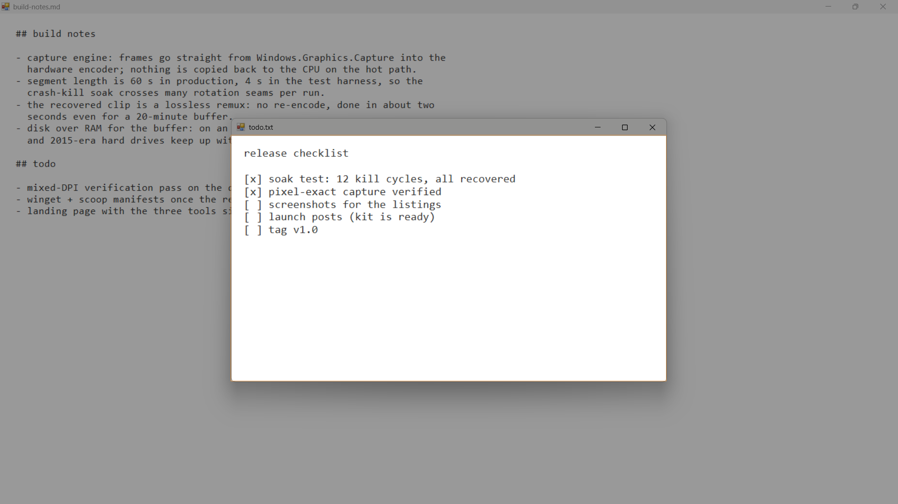

<div align="center">

# Memento

**Region and display capture for Windows that stays out of your way.**

Tray-only · ~8 MB of RAM · under 1 MB to download · no uploads · no editor · no telemetry · no phone-home (unless you opt in to update notifications)

[](https://github.com/blancodagoat/memento/actions/workflows/build.yml)



</div>

---

## Quick start

1. Download `Memento.exe` from the [latest release](https://github.com/blancodagoat/memento/releases/latest). It is under 1 MB; if the .NET 10 Desktop Runtime is missing, Windows shows a dialog that links straight to the installer. Prefer zero installs? Take `Memento-self-contained.exe` instead. Scoop users: `scoop bucket add blancodagoat https://github.com/blancodagoat/scoop-bucket` then `scoop install memento`.
2. Run it. An icon appears in the tray; there is no main window.
3. Press **Print Screen**.

| | |
|---|---|
| **Print Screen** | interactive region capture |
| **F8** | full capture of the display holding the foreground window |

Both shortcuts are rebindable. The tray icon is the entry point: double-click for settings, right-click for capture actions, open/copy last capture, the screenshots folder, and a click-only update check (the app never checks on its own).

## Capturing

In region capture, the window (or pane) under the cursor highlights itself. Click to take it as-is, or drag to select freehand.

Every capture is saved as a PNG and copied to the clipboard. If the save fails, the clipboard copy still happens and the error is left in the tray tooltip; a "Report last error…" entry also appears in the tray menu, which opens a prefilled GitHub issue in your browser (paths scrubbed) for you to review and submit — the app itself sends nothing.

Shots land in `%USERPROFILE%\Pictures\Memento` by default, nested by year and month:

```
<root>\2026\08 Aug\chrome_2026-08-10_143052.png
```

## The confirmation card

A small card in the bottom-right corner (thumbnail, filename, size) confirms each capture, then fades out after a few seconds.

- It never steals focus. Hovering pauses it; clicking reveals the file in Explorer.
- While a fullscreen game, presentation, or Focus Assist is active, no card appears at all, since showing one could knock a game out of exclusive fullscreen. A failed save is queued to the notification center instead so it cannot vanish silently.
- Taking a second screenshot hides the card first, so it never appears inside its successor.

## Footprint

Idle in the tray, which is where a screenshot tool spends its life:

| Tool | Idle memory |
|---|---|
| **Memento** | **~8 MB** |
| Greenshot | 15-30 MB |
| ShareX | 50-300 MB, version-dependent |
| Snagit | 200+ MB |
| FireShot | runs inside your browser, so its cost hides in the browser's |

Memento's figure is measured: the private working set (Task Manager's "Memory" column) of the published Release build, idle in the tray on Windows 11.

The other figures are as reported by users and reviews ([Greenshot's FAQ](https://getgreenshot.org/faq/greenshot-uses-x-mb-of-my-ram-why-is-that/), [ShareX's issue tracker](https://github.com/ShareX/ShareX/issues/3179), and [side-by-side reviews](https://www.screensnap.pro/blog/sharex-vs-greenshot)) and vary with version and configuration, so read them as ballpark rather than benchmark.

Memory spikes while a capture is in flight (the frame exists as a bitmap) and returns to baseline when the card is gone.

## Building

Requires the .NET 10 SDK. Two flavors, both a single `Memento.exe`:

```
# Framework-dependent (~0.4 MB), needs the .NET 10 Desktop Runtime on the machine
dotnet publish src/Memento/Memento.csproj -c Release -p:SelfContained=false

# Self-contained (~115 MB), runs anywhere, runtime bundled in
dotnet publish src/Memento/Memento.csproj -c Release
```

The framework-dependent build is the default download: it is under half a megabyte, and if the runtime is missing, Windows shows a dialog that links straight to the installer. The self-contained build is the no-questions-asked fallback. CI attaches both to the release.

Building on a non-Windows host works too, with `-p:EnableWindowsTargeting=true`. The icons are generated rather than checked in by hand; `python3 tools/make-icons.py` rewrites `assets/` from scratch.

### A note on size

The self-contained build sets `PublishSingleFile` and `SelfContained`, but **not** `PublishTrimmed`: the SDK rejects trimming outright for Windows Forms (`NETSDK1175`, a hard error), so the runtime is carried whole and the executable lands around 115 MB on disk.

Single-file *compression* is also off, deliberately. Compressed assemblies are inflated into private, unshareable memory at startup: measured here, that was ~70 MB of resident RAM against ~8 MB without compression, where assemblies map file-backed straight from the executable. Disk is paid once; RAM is paid all day. If you want the smaller file anyway, publish with `-p:EnableCompressionInSingleFile=true` and the executable drops to ~50 MB at exactly that memory cost.

## Print Screen and Snipping Tool

Short version: while a hotkey is bound to Print Screen, Memento claims the key from Snipping Tool for you, and says so with a card rather than acting silently.

The long version. Windows has its own setting, *Use the Print screen key to open screen capture*, that hands the key to Snipping Tool, and it defaults to on. When it is on, `RegisterHotKey` on Print Screen still *succeeds*, so nothing looks broken; the key simply never arrives.

Memento turns that setting off itself: it writes the same `HKCU\Control Panel\Keyboard\PrintScreenKeyForSnippingEnabled` value the Settings toggle writes and broadcasts the change so it applies without a sign-out. This runs at launch and after a rebind. If the registry write ever fails, a one-time notice points at the Settings page instead. Rebind away from Print Screen and Memento stops touching the setting.

## Where things are kept

- Configuration: `%APPDATA%\Memento\config.json` (hotkeys and save location only).
- Start with Windows: `HKCU\Software\Microsoft\Windows\CurrentVersion\Run`. The registry is
  the only record of it, so the checkbox stays honest if the value is removed elsewhere.

## Tests

```
dotnet run --project tests/Memento.Tests            # headless suite
dotnet run --project tests/Memento.Tests -- smoke   # + live capture geometry on the real desktop
```

53 assertions over the logic that does not need a live desktop: hotkey parsing and formatting (a round-trip failure here would quietly reset the user's shortcuts on every launch), source-app name sanitising, output path construction including same-second collision suffixes, window/control hit-testing for hover capture, and the legacy month-folder migration. The project compiles the production source files in directly rather than copying them.

## Verification status

Exercised on Windows 11 hardware: capture, clipboard hand-off, PNG output, the tray icon and menu, the settings window, hotkey rebinding, and the capture card.

Still outstanding: the mixed-DPI pass (150% primary + 100% secondary), checking that captures are pixel-exact and that region selection lands where the mouse was dragged on both monitors. The overlay deliberately swallows `WM_DPICHANGED` and re-asserts its bounds, which is the part most worth confirming. The check itself is automated — `dotnet run --project tests/Memento.Tests -- smoke` verifies pixel-exact capture and a real synthetic drag on every attached display, and drags across the display boundary when there are two — but it has only been run on a single-DPI machine so far; running it once on a mixed-DPI pair closes this item.
